# Documentación Técnica del Prototipo — Tercer Corte
**CampusShield · Vibras Corporation · Capstone Design Project**
_Ricardo Cortés · Juan Montes · Daniel Pareja · Julián Zafra — Abril 2026_

---

## 9. Definición de Arquitectura de la Solución

### 9.1 Visión General del Sistema

CampusShield es una **Progressive Web App (PWA)** de tipo "super app" de seguridad universitaria. La decisión de adoptar el modelo PWA fue estratégica: permite que la misma base de código funcione tanto en dispositivos móviles (Android e iOS, instalable desde el navegador) como en escritorio, sin necesidad de desarrollar y mantener aplicaciones nativas separadas, reduciendo drásticamente los costos y tiempos de desarrollo.

La arquitectura del prototipo MVP fue diseñada bajo tres principios rectores:

1. **Despliegue inmediato sin backend**: El MVP opera íntegramente en el cliente mediante `localStorage` como capa de persistencia, permitiendo validar flujos de usuario sin costos de infraestructura durante la fase de prueba de concepto.
2. **Modularidad orientada a escalamiento**: Cada módulo (auth, store, views, app) tiene responsabilidades claramente separadas, facilitando la migración a una arquitectura con backend real en fases posteriores.
3. **PWA-first como puente multiplataforma**: La arquitectura PWA elimina la necesidad de apps nativas separadas, aprovechando capacidades del navegador (Service Workers, Web Push, instalación en pantalla de inicio) para ofrecer una experiencia equivalente a una app nativa tanto en móvil como en PC.

### 9.2 Arquitectura del MVP (Estado Actual)

#### 9.2.1 Diagrama de Componentes — Prototipo de Prueba de Concepto

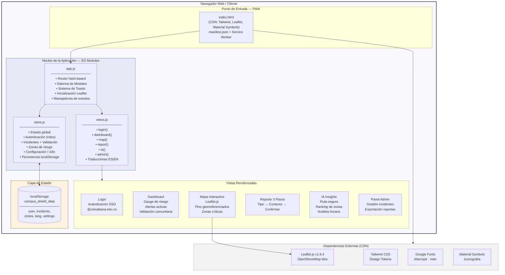

#### 9.2.2 Arquitectura Objetivo — Solución Completa (Fase 2-3)

La estrategia PWA permite que **una sola aplicación** atienda todos los dispositivos:

- **Móvil (Android/iOS):** instalable desde el navegador como app nativa, con acceso a notificaciones push, almacenamiento offline y pantalla de inicio.
- **Escritorio (PC/Mac):** la misma app web funciona como aplicación de escritorio instalable sin pasar por tiendas de aplicaciones.

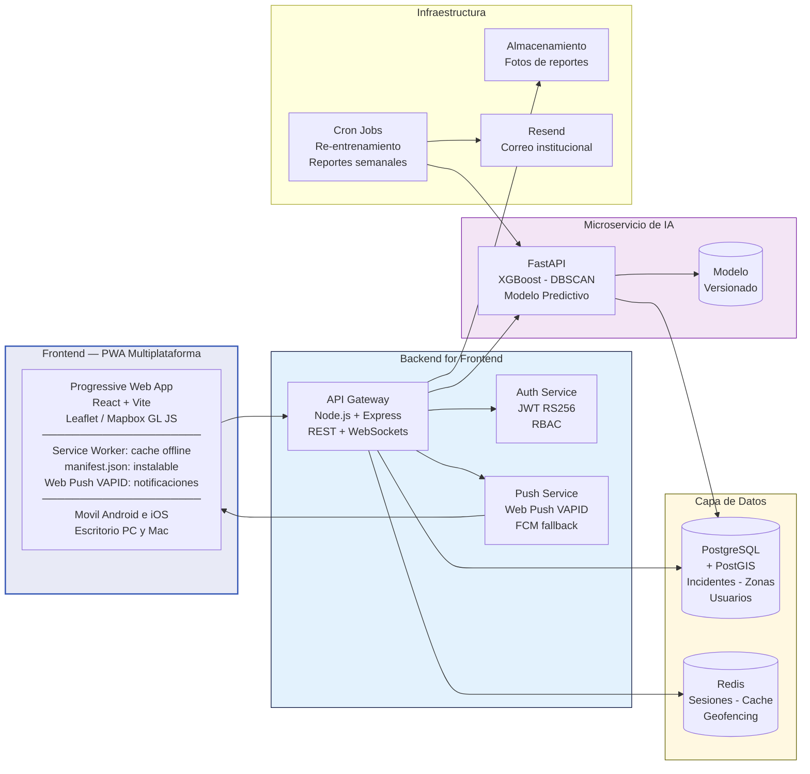

### 9.3 Flujos de Interacción

#### 9.3.1 Flujo de Autenticación y Control de Acceso por Rol

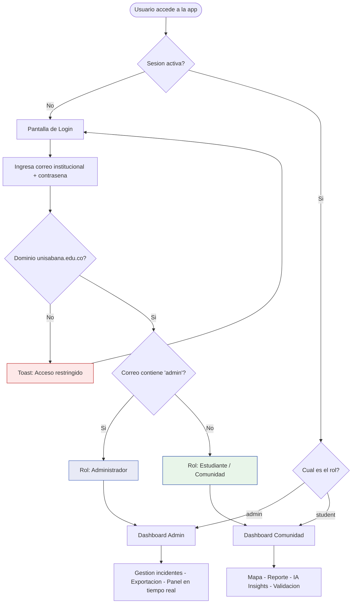

#### 9.3.2 Flujo de Reporte de Incidente — 3 Pasos

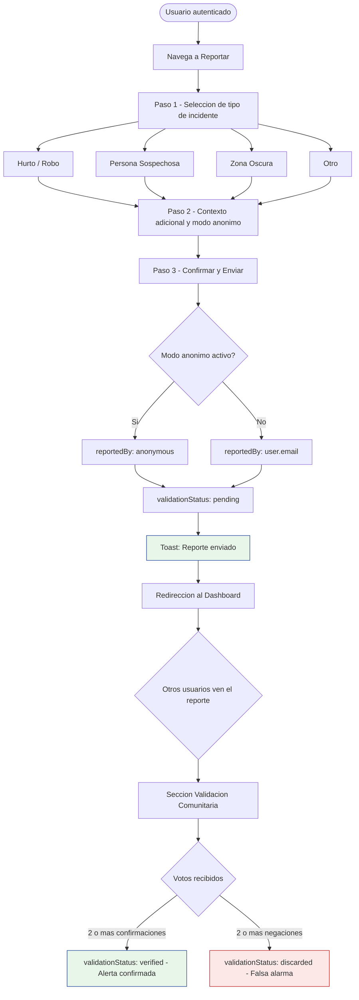

#### 9.3.3 Flujo de Validación Comunitaria (Estilo Waze)

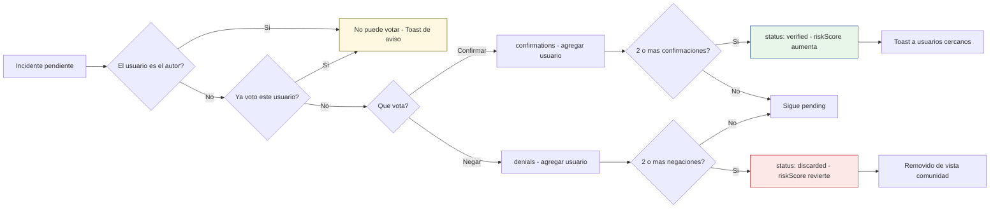

#### 9.3.4 Flujo del Panel Administrador

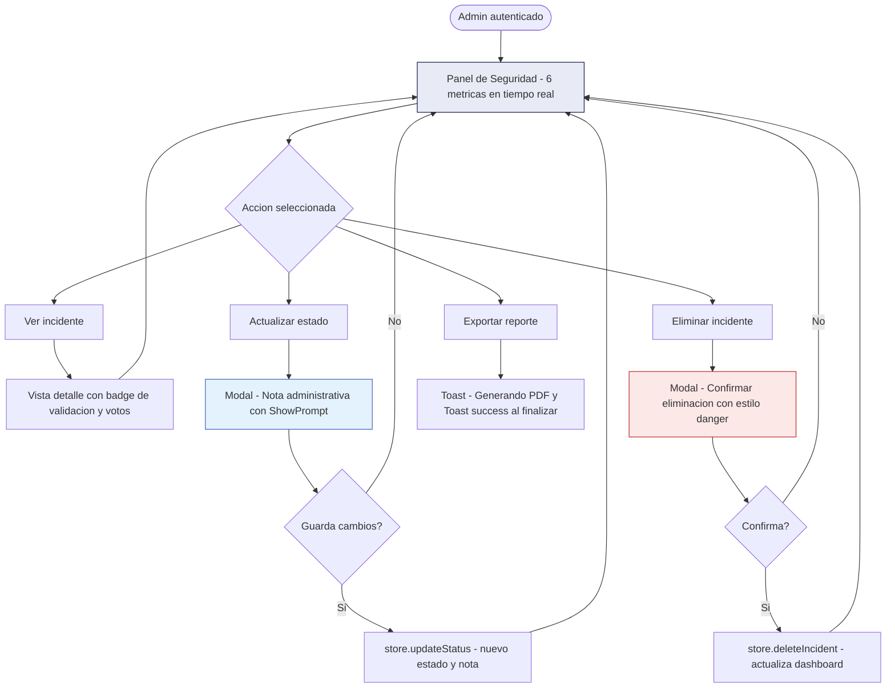

### 9.4 Modelo de Datos del Prototipo

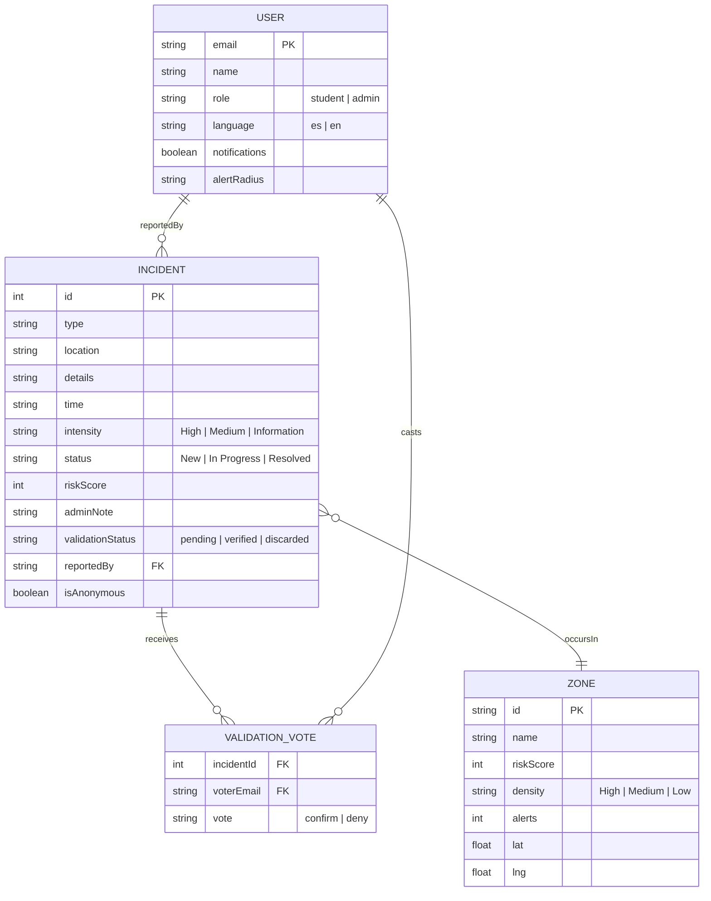

---

## 10. Diseño de la Solución y Planeación del Sprint

### 10.1 Sistema de Diseño — CampusShield Design System

El diseño de CampusShield fue formulado bajo la filosofía **"The Institutional Guardian"**: una experiencia editorial de alta gama que combina la autoridad institucional de la Universidad de La Sabana con una estética de tecnología de punta.

#### 10.1.1 Tokens de Color y Jerarquía Semántica

| Token | Valor HEX | Uso |
|-------|-----------|-----|
| `primary` | `#000a34` | Identidad principal, texto de alta jerarquía |
| `primary-container` | `#001c65` | CTAs, gradientes de acción |
| `secondary` | `#3759b6` | Interacciones activas, badges |
| `error` | `#ba1a1a` | Riesgo alto, alertas críticas, SOS |
| `tertiary` | `#636100` | Riesgo medio, advertencias |
| `on-secondary-fixed-variant` | `#18409d` | Riesgo bajo, zona segura |
| `surface` | `#faf9ff` | Canvas base |
| `surface-container-low` | `#f2f3fd` | Áreas de contenido secundario |

#### 10.1.2 Reglas de Diseño Aplicadas

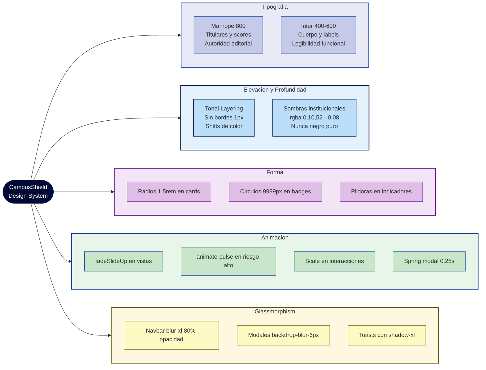

### 10.2 Wireframes y Mockups del Prototipo

Los siguientes diseños fueron elaborados mediante la herramienta **Stitch (AI-assisted UI design)** y representan la base visual que guió el desarrollo del prototipo funcional CampusShield.

---

#### 10.2.1 Pantalla de Login — Autenticación Institucional

**Descripción:** Pantalla de acceso dividida en dos paneles (desktop) con identidad visual de La Sabana. El formulario exige correo `@unisabana.edu.co` y asigna rol automáticamente.

**HU asociada:** HU-SYS-01 · **RF:** RF-SYS-01-A, RF-SYS-01-B, RF-SYS-01-C

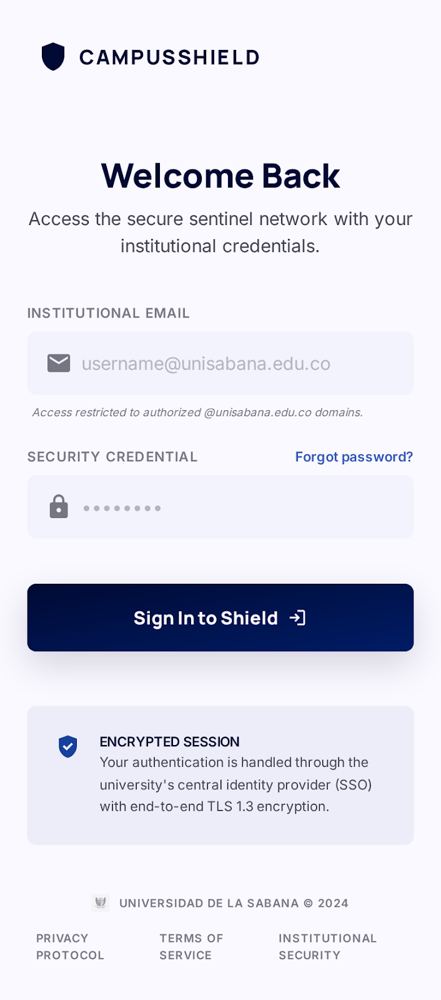

**Decisiones de diseño evidenciadas:**
- Panel izquierdo con imagen del campus + overlay institucional azul oscuro
- Campos con iconos de Material Symbols (mail, lock)
- Botón CTA con gradiente `primary → primary-container`
- Selector de idioma ES/EN en la parte inferior
- Indicador de "Sesión Encriptada" con icono `verified_user`

---

#### 10.2.2 Dashboard Comunidad — Vista Principal del Estudiante

**Descripción:** Vista central del usuario estudiante. Incluye gauge de riesgo de zona actual, tarjeta de acción rápida para reportar, sección de validación comunitaria y listado de alertas activas.

**HU asociada:** HU-CU-01, HU-CU-02, HU-CU-03 · **RF:** RF-M01-01, RF-M03-01

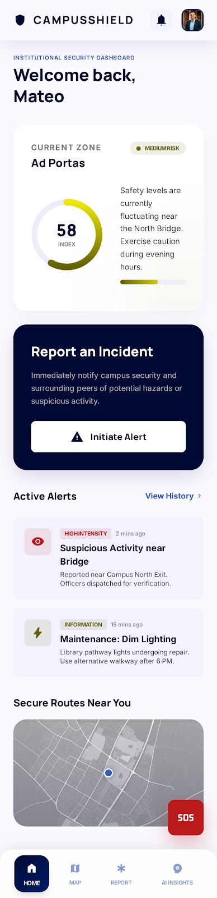

**Elementos visuales clave:**
- **Shield Gauge**: Componente radial SVG con score de riesgo (0-100)
- **Tarjetas de incidente**: Borde izquierdo semafórico (rojo/ámbar/azul)
- **Sección de validación**: Cards pendientes con botones "¿Sigue ahí?"
- **FAB SOS**: Botón circular rojo con animación `animate-ping`

---

#### 10.2.3 Mapa Interactivo — Zonas Críticas Georreferenciadas

**Descripción:** Mapa del campus de la Universidad de La Sabana (Chía) con pins de riesgo fijados a coordenadas reales mediante Leaflet.js. Incluye panel inferior de zonas críticas ordenadas por score.

**HU asociada:** HU-CU-02 · **RF:** RF-M02-01

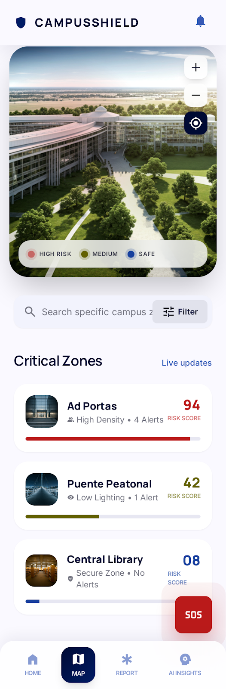

**Zonas implementadas con coordenadas reales:**

| Zona | Coordenadas | Score | Color |
|------|-------------|-------|-------|
| Ad Portas | 4.863640, -74.031723 | 58 | Ámbar |
| Portón Café | 4.863549, -74.037457 | 15 | Azul (seguro) |
| Puente Madera | 4.858675, -74.031506 | 82 | Rojo (alto riesgo) |

---

#### 10.2.4 Flujo de Reporte — 3 Pasos

El flujo de reporte fue diseñado bajo el principio de **máximo 3 pasos** (RF-M03-01), reduciendo la fricción para que cualquier miembro de la comunidad pueda reportar un incidente en menos de 30 segundos. Una barra de progreso segmentada en 3 tramos acompaña al usuario durante todo el flujo.

**HU asociada:** HU-CU-01 · **RF:** RF-M03-01, RF-M03-02

> **Nota de diseño:** La iteración inicial contemplaba una pantalla única con todos los campos (tipo, descripción y GPS) en una sola vista. Tras la validación con usuarios, se migró al flujo de 3 pasos para reducir la carga cognitiva y permitir el modo anónimo como decisión explícita del usuario.

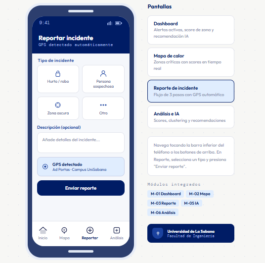

---

**Paso 1 — Selección del tipo de incidente**

El usuario ve una grilla de 4 botones con icono y etiqueta. El botón de "Zona Oscura" ocupa el ancho completo (col-span-2) por ser el tipo más reportado en las zonas críticas identificadas. Al seleccionar cualquier tipo, avanza automáticamente al paso 2.

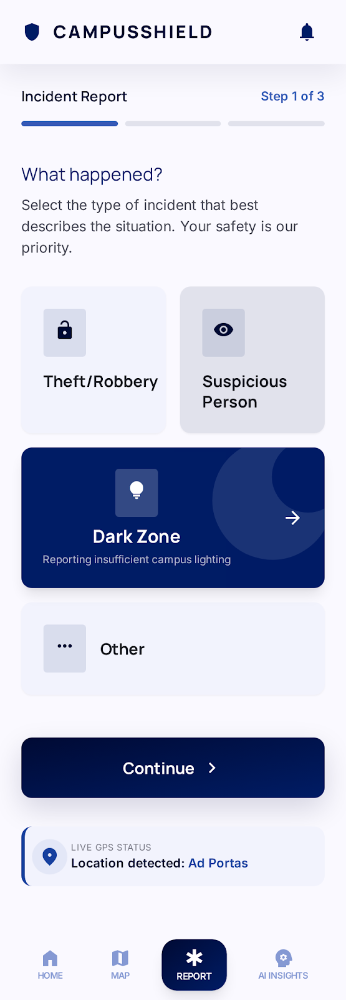

| Tipo | Icono | Intensidad asignada |
|------|-------|---------------------|
| Hurto / Robo | `lock_open` | Alta |
| Persona Sospechosa | `visibility` | Media |
| Zona Oscura | `lightbulb_outline` | Media |
| Otro | `emergency` | Media |

---

**Paso 2 — Contexto adicional**

El usuario puede añadir una descripción libre del incidente y activar el **modo anónimo**. Si el modo anónimo está activo, el campo `reportedBy` se disocia de la identidad del usuario antes de persistir (no es un enmascaramiento posterior, sino una decisión en el backend).

Elementos de la pantalla:
- `textarea` con placeholder *"Describe el incidente..."* (5 filas)
- Checkbox `Reporte Anónimo` con label bold y fondo `surface-container-lowest`
- Botón CTA `Revisar Ubicación` con gradiente institucional `primary → primary-container`
- Botón `← Volver` para regresar al Paso 1 sin perder los datos

---

**Paso 3 — Confirmar ubicación y enviar**

Pantalla de confirmación final. La ubicación detectada automáticamente (`Ad Portas Building`) se presenta en una tarjeta con borde izquierdo azul institucional. El usuario puede enviar o volver al Paso 2. Al confirmar, se dispara `store.addIncident()` con `validationStatus: pending` y se muestra un toast de confirmación.

Elementos de la pantalla:
- Tarjeta de ubicación con icono `location_on` y texto *"Ad Portas Building"*
- Botón principal `Enviar Reporte` con icono `send`
- Botón `← Volver` al Paso 2
- **Post-envío:** toast verde *"Reporte enviado con éxito · La comunidad podrá verificarlo pronto"*

---

#### 10.2.5 IA Insights — Rutas Seguras y Análisis Predictivo

**Descripción:** Vista de inteligencia artificial con 4 tarjetas dinámicas: planificador de ruta segura, ranking de zonas por riesgo, estadísticas comunitarias (verificados/falsas alarmas) y análisis de riesgo por franja horaria.

**HU asociada:** HU-CU-04, HU-AD-01 · **RF:** RF-M05-01, RF-M05-02

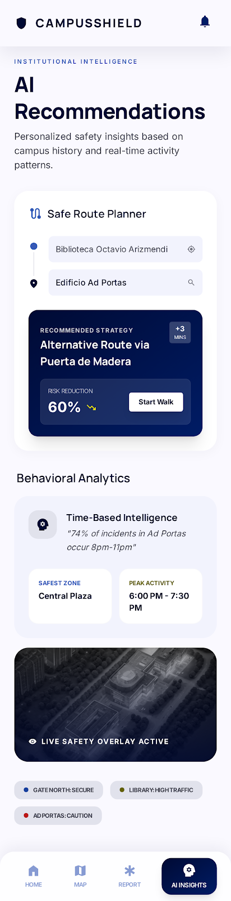

---

#### 10.2.6 Panel de Administración de Seguridad

**Descripción:** Panel exclusivo para el rol Administrador. Muestra 6 métricas en tiempo real, listado de todos los incidentes con badges de validación, y acciones de gestión (actualizar estado, eliminar, exportar).

**HU asociada:** HU-AD-02, HU-AD-03 · **RF:** RF-M06-01, RF-M06-02

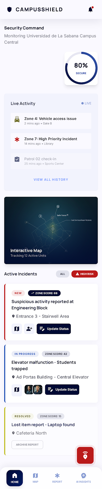

---

#### 10.2.7 Vistas Adicionales del Diseño

Los siguientes mockups complementarios evidencian la iteración del proceso de diseño y exploración visual previa a la versión final implementada:

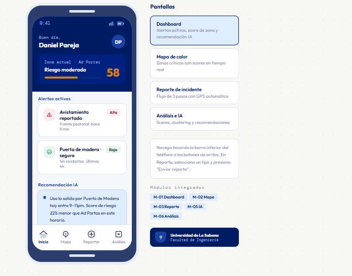
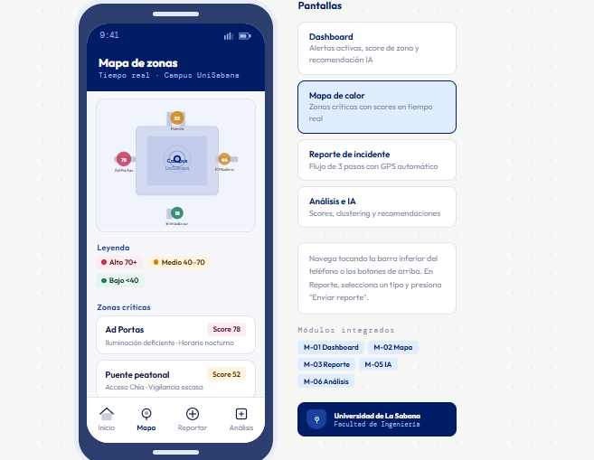
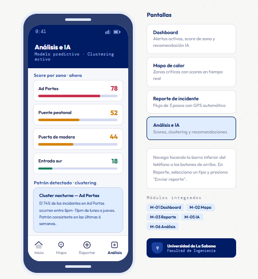

### 10.3 Planeación del Sprint de Construcción

#### 10.3.1 Estructura del Sprint — Metodología Ágil

El prototipo MVP se planeó y ejecutó en un **único sprint de 6 semanas** (19 de abril – 30 de mayo de 2026), organizado en tres fases de entrega incremental basadas en el backlog priorizado por la escala Fibonacci.

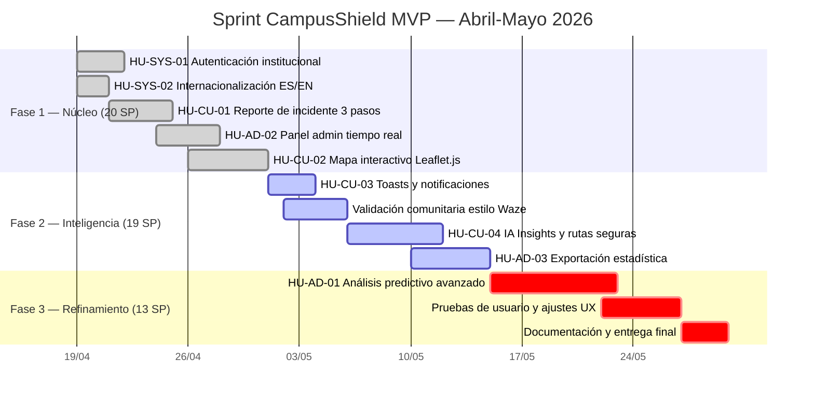

#### 10.3.2 Distribución de Story Points por Fase

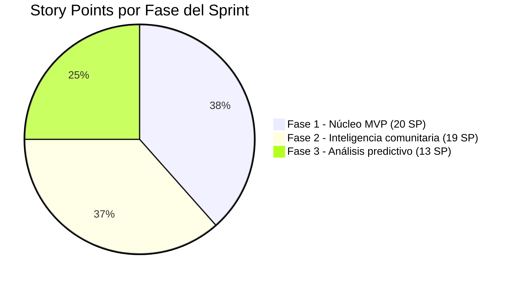

#### 10.3.3 Asignación de Roles por Historia de Usuario

| Historia | SP | Responsable Principal | Soporte |
|----------|----|-----------------------|---------|
| HU-SYS-01 Auth | 3 | Daniel Pareja (Dev) | Ricardo Cortés |
| HU-SYS-02 i18n | 2 | Daniel Pareja (Dev) | Julián Zafra |
| HU-CU-01 Reporte | 5 | Daniel Pareja (Dev) | Juan Montes |
| HU-CU-02 Mapa | 5 | Daniel Pareja (Dev) | Juan Montes |
| HU-CU-03 Notif. | 3 | Daniel Pareja (Dev) | Julián Zafra |
| HU-CU-04 IA Routes | 8 | Julián Zafra (Ideador) | Daniel Pareja |
| HU-AD-01 Predictivo | 13 | Juan Montes (Clarif.) | Julián Zafra |
| HU-AD-02 Panel Admin | 5 | Ricardo Cortés (Impl.) | Daniel Pareja |
| HU-AD-03 Reportes | 8 | Ricardo Cortés (Impl.) | Juan Montes |

> Los roles Foursight del equipo (Implementador, Clarificador, Desarrollador, Ideador) guiaron la asignación: el Implementador (Ricardo) lideró la ejecución del panel admin, el Clarificador (Juan) el análisis predictivo, el Desarrollador (Daniel) el stack técnico completo, y el Ideador (Julián) los módulos de IA y experiencia.

#### 10.3.4 Estado de Implementación — Funcionalidades del MVP

| Funcionalidad | Estado | Historia | RF |
|---------------|--------|----------|----|
| Login con roles (student/admin) | ✅ Implementado | HU-SYS-01 | RF-SYS-01-A/B/C |
| Internacionalización ES/EN | ✅ Implementado | HU-SYS-02 | RF-SYS-02 |
| Reporte de incidente 3 pasos | ✅ Implementado | HU-CU-01 | RF-M03-01 |
| Mapa Leaflet con pins coordenados | ✅ Implementado | HU-CU-02 | RF-M02-01 |
| Validación comunitaria (Waze-style) | ✅ Implementado | HU-CU-03 | RF-M04-01 |
| Sistema de toasts in-app | ✅ Implementado | HU-CU-03 | RF-SYS-03 |
| IA Insights (datos reales del store) | ✅ Implementado | HU-CU-04 | RF-M05-01 |
| Panel administrador en tiempo real | ✅ Implementado | HU-AD-02 | RF-M06-01 |
| Modales personalizados (sin alerts nativos) | ✅ Implementado | HU-AD-02 | RF-M06-01 |
| SOS de emergencia | ✅ Implementado | HU-CU-01 | RF-M03-01 |
| Gestión de estado de incidentes | ✅ Implementado | HU-AD-02 | RF-M06-01 |
| Exportación estadística | 🔄 Simulado (toast) | HU-AD-03 | RF-M06-02 |
| Modelo predictivo XGBoost real | ⏳ Fase 3 | HU-AD-01 | RF-M05-02 |
| Clustering DBSCAN | ⏳ Fase 3 | HU-AD-01 | RF-M05-02 |

---

## 11. Integración y Organización de Evidencias

### 11.1 Trazabilidad Completa: Problema → Solución

La siguiente sección demuestra la coherencia entre cada componente del proyecto, desde la identificación del problema hasta el prototipo funcional, pasando por el backlog, el diseño y el impacto triple.

```mermaid
flowchart TD
    subgraph P["1. PROBLEMA IDENTIFICADO"]
        P1["32 entrevistas estructuradas\n14.500 personas afectadas"]
        P2["41% seguridad ciudadana\n59% movilidad urbana"]
        P3["Zonas críticas georreferenciadas:\nAd Portas · Puente Madera · Portón Café"]
    end

    subgraph R["2. RETO DE DISEÑO"]
        R1["¿Cómo podríamos diseñar una solución tecnológica\nque mejore la seguridad universitaria utilizando\ndatos geoespaciales y participación comunitaria?"]
    end

    subgraph B["3. BACKLOG PRIORIZADO"]
        B1["9 Historias de Usuario\n52 Story Points\nEscala Fibonacci + INVEST"]
        B2["Alta prioridad MVP:\nAuth · Mapa · Reporte · Admin Panel"]
    end

    subgraph D["4. DISEÑO"]
        D1["Design System: The Institutional Guardian\nPaleta institucional #000a34"]
        D2["6 Mockups en Stitch\nLogin · Dashboard · Mapa · Reporte · IA · Admin"]
    end

    subgraph PR["5. PROTOTIPO FUNCIONAL"]
        PR1["CampusShield MVP\nVanilla JS SPA · Leaflet.js · Tailwind CSS"]
        PR2["Funcionalidades implementadas:\nValidación comunitaria · Modales · Toasts · Mapa Leaflet"]
    end

    subgraph TI["6. TRIPLE IMPACTO + ODS 11"]
        TI1["Económico:\nReducción costos operativos seguridad"]
        TI2["Social:\nMejora percepción seguridad comunidad"]
        TI3["Ambiental:\nRutas seguras → menos desplazamientos\ninnecesarios → menor huella de carbono"]
    end

    P --> R
    R --> B
    B --> D
    D --> PR
    PR --> TI

    style P fill:#fff3e0,stroke:#636100
    style R fill:#e8eaf6,stroke:#3759b6
    style B fill:#e3f2fd,stroke:#000a34
    style D fill:#f3e5f5,stroke:#7b1fa2
    style PR fill:#e8f5e9,stroke:#18409d
    style TI fill:#fce4ec,stroke:#ba1a1a
```

### 11.2 Coherencia entre Dolor Identificado y Funcionalidad Implementada

| Dolor identificado en entrevistas | Feature de CampusShield | HU | RF |
|-----------------------------------|------------------------|----|----|
| "Zonas oscuras y sin seguridad en Ad Portas" | Mapa de riesgo con score por zona + pin rojo en Ad Portas (score 58) | HU-CU-02 | RF-M02-01 |
| "Personas sospechosas en el puente y portón" | Reporte de incidente 3 pasos + tipo 'Suspicious Person' | HU-CU-01 | RF-M03-01 |
| "Respuesta institucional lenta o nula (92.4%)" | Panel admin en tiempo real + validación comunitaria inmediata | HU-AD-02 | RF-M06-01 |
| "No hay información sobre zonas peligrosas" | IA Insights: ranking de zonas + consejo por franja horaria | HU-CU-04 | RF-M05-01 |
| "Reportes no tienen seguimiento formal" | Sistema de estados (New → In Progress → Resolved) + nota admin | HU-AD-02 | RF-M06-01 |
| "Comunidad no puede participar en seguridad" | Validación comunitaria Waze-style (confirm/deny con umbral 2 votos) | HU-CU-03 | RF-M04-01 |
| "Barrera lingüística para estudiantes internacionales" | i18n completo ES/EN con cambio instantáneo | HU-SYS-02 | RF-SYS-02 |

### 11.3 Contribución al Triple Impacto

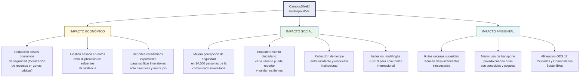

### 11.4 Alineación con ODS 11 — Evidencia por Meta

| Meta ODS 11 | Evidencia en el Proyecto |
|-------------|--------------------------|
| **Meta 11.2** Transporte sostenible | IA Insights calcula la ruta con menor exposición al riesgo, promoviendo desplazamientos más seguros y eficientes |
| **Meta 11.3** Urbanización participativa | 32 entrevistas como base + validación comunitaria Waze-style permite co-gestión de la seguridad |
| **Meta 11.7** Espacios públicos seguros | Mapa de calor con zonas críticas georreferenciadas (Ad Portas, Puente Madera, Portón Café) |
| **Meta 11.b** Políticas integradas de resiliencia | Panel admin con exportación de reportes para toma de decisiones institucionales basadas en datos |

### 11.5 Arquitectura de la Solución vs. Requerimientos No Funcionales

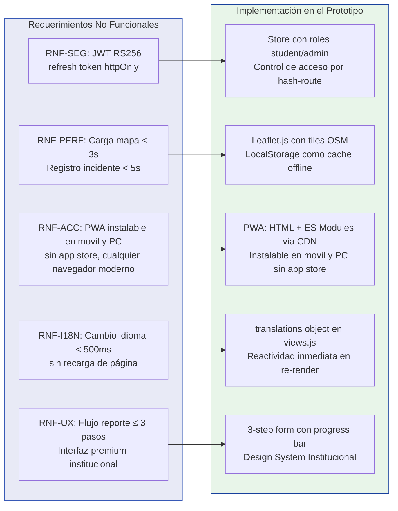

### 11.6 Evolución del Diseño: Del Mockup al Prototipo Funcional

El proceso de diseño siguió una trayectoria clara de fidelidad creciente:

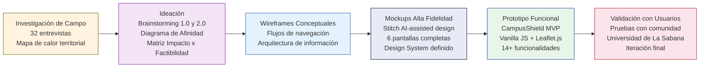

### 11.7 Resumen Ejecutivo de Evidencias

| Entregable | Estado | Evidencia |
|-----------|--------|-----------|
| **Investigación de campo** | ✅ Completo | 32 entrevistas, 5 áreas del conocimiento, mapa de calor |
| **Definición del problema** | ✅ Completo | 41% seguridad, 59% movilidad. Problema escogido: seguridad |
| **Reto de diseño** | ✅ Completo | Formulado, validado cuantitativa y cualitativamente |
| **Backlog con HU** | ✅ Completo | 9 HU, 52 SP, criterios Gherkin, validación INVEST |
| **Requisitos IEEE 830** | ✅ Completo | RF y RNF con trazabilidad completa |
| **Sistema de diseño** | ✅ Completo | Design System "The Institutional Guardian" |
| **Mockups (Stitch)** | ✅ Completo | 6 pantallas + 4 iteraciones adicionales |
| **Prototipo funcional** | ✅ Completo | CampusShield MVP, 14 funcionalidades implementadas |
| **Arquitectura documentada** | ✅ Completo | MVP + Arquitectura objetivo, flujos de interacción, ER |
| **Sprint planning** | ✅ Completo | 3 fases, Gantt, distribución de SP por perfil Foursight |
| **Triple impacto documentado** | ✅ Completo | Económico + Social + Ambiental con alineación ODS 11 |
| **Validación con usuarios** | 🔄 En progreso | Pruebas de concepto con comunidad universitaria |

---

_Documento generado para el Tercer Corte — Capstone Design Project · Facultad de Ingeniería · Universidad de La Sabana · Abril 2026_
